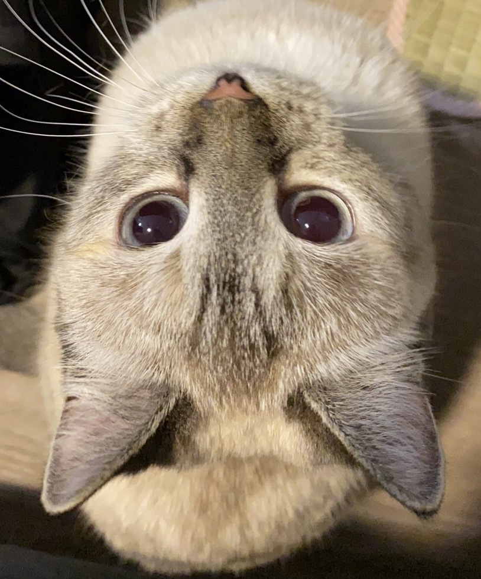

# Xiuwen's GitHub Page


## About Me As a Programmer
- **Languages Learning:** `Python`,`Java`,`C/C++`
* **Current and Continous Learning Focus:** || Languages || Data Structures & Algorithms || AI & Machine Learning || Web Development || Version Control || Problem-Solving
+ **Python Coding Example:**
```python
def hello_world():
    print("Welcome to my GitHub page!")
```
+ A code that I found <ins>inspiring</ins>: *If, at first, you do not succeed, call it version 1.0.* - Khayri R. R. Woulfe


## About Me as a Person
- Hobbies:
  1. Watching movies
  2. Exploring food
  3. Photography
  4. Gaming
  5. ~~Sleeping~~ Relaxation with music

## Links
1. This site was to the useful [Markdown](https://docs.github.com/en/get-started/writing-on-github/getting-started-with-writing-and-formatting-on-github/basic-writing-and-formatting-syntax) resourse.
2. Link to the section about me: [About Me as a Person](https://github.com/Xwinner7/Lab-Week-1/blob/new-read-me/index.md#about-me-as-a-person).
3. [Cute cat](./cat.jpg). 

### To Do
- [x] Complete GitHub profile
- [ ] Build a portfolio website
- [ ] Explore GitHub
